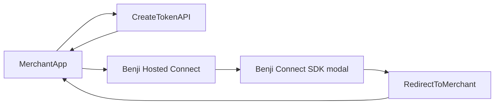

## Overview

**Benji Hosted Connect** is a fully hosted solution that allows you to connect your members to reward loyalty partners without integrating an SDK into your application. You send users to **Benji Hosted Connect**, which loads the [**Benji Connect SDK**](/connect/introduction) behind the scenes as a modal. You can also drive the flow entirely via **redirect**: create a token on your server, send the user to the **Benji Hosted Connect** URL with `connect_token`, and optionally return them to your app using a **Redirect URL** configured in Pilot.

This approach is ideal for:

- **Quick integration** — Get started without any frontend code changes beyond linking or redirecting
- **Server-side flows** — Connect users through email campaigns or backend-generated URLs
- **Multi-platform support** — One **Benji Hosted Connect** URL pattern for web, mobile and other platforms

<Tip>
  **Benji Hosted Connect** and the [**Benji Connect
  SDK**](/connect/introduction) use the same token and callback semantics.
  Choose **Benji Hosted Connect** (redirect) for simplicity, or embed the
  **Benji Connect SDK** in your own app when you need the modal inside your UI.
</Tip>

## How it works (high level)



1. [Create a connect token](/connect/create_token) on your server using your **partner API key** (from [Pilot Developer](/pilot/developer)) and the fields your flow needs (`partnership_id`, `mode`, optional `user_external_id`, optional `custom_attributes`, etc.).
2. Send the user to **Benji Hosted Connect**. Either:
   - Use the **`connect_url`** from the Create Token response and append the token: `<connect_url>?connect_token=<token>`, **or**
   - Open the **Benji Hosted Connect** base URL for your partnership and pass `connect_token` (and other query parameters below) as needed.
3. The user completes Connect (link, transfer, or redeem depending on [mode](/connect/modes)) in the modal inside **Benji Hosted Connect**.
4. If you configured a **Redirect URL** in Pilot, the browser is sent back to your URL with query parameters describing the outcome (see [Redirect URL and query parameters](#redirect-url-and-query-parameters)).
5. Use [Exchange Token](/connect/exchange_token) with the short-lived token from a successful flow when you need long-lived API access. Subscribe to [webhooks](/api-reference/webhooks/overview) for asynchronous lifecycle events.

Alternatively, Benji can connect to your IdP for native authentication of your users. Contact your Benji account manager for IdP setup.

## Building the Benji Hosted Connect URL

After [Create Token](/connect/create_token), you receive:

- **`token`** — Short-lived connect token used to initialize Connect.
- **`connect_url`** — Base URL for **Benji Hosted Connect** for this partnership (format may vary by environment).

Append the token so Connect can start:

```
<connect_url>?connect_token=<token>
```

You may add other query parameters supported by **Benji Hosted Connect** (see next section). For correlation (e.g. CSRF protection or “which cart”), pass **`state`** on the inbound URL; it is echoed back on the [redirect](#redirect-url-and-query-parameters).

## Benji Hosted Connect query parameters

These parameters apply when the user lands on **Benji Hosted Connect**. Exact behavior is defined by the **Benji Hosted Connect** implementation; the following reflects the reference integration pattern.

| Parameter          | Required | Description                                                                                                                                                                                   |
| ------------------ | -------- | --------------------------------------------------------------------------------------------------------------------------------------------------------------------------------------------- |
| `connect_token`    | No\*     | If present, **Benji Hosted Connect** uses this token to open Connect. If omitted, **Benji Hosted Connect** may create a token server-side using the partnership context and other parameters. |
| `mode`             | No       | Connect flow mode: `1` = Connect, `3` = Transfer, `4` = Redeem (defaults to `1`). See [Connect modes](/connect/modes).                                                                        |
| `user_external_id` | No       | Your user identifier; forwarded into token creation when **Benji Hosted Connect** creates a token.                                                                                            |
| `amount`           | No       | When set together with `mode`, can be used to build `custom_attributes.actions` (e.g. transfer amount).                                                                                       |
| `state`            | No       | Opaque value echoed back on redirect to your **Redirect URL** for correlation.                                                                                                                |
| `preview`          | No       | Pilot preview mode (e.g. `preview=1`) for reviewing **Benji Hosted Connect** content from the dashboard.                                                                                      |

\* **Token source:** For production flows, prefer passing `connect_token` from your server after Create Token, or rely on server-side token creation on **Benji Hosted Connect** when your integration supplies the right context.

### Resolving the partnership

**Benji Hosted Connect** resolves which partnership to show by:

- **Path** — e.g. `https://<host>/<partnershipId>` (common for default hosted domains), or
- **Hostname** — **custom domain** configured in Pilot for the partnership.

## Redirect URL and query parameters

Configure where users return **after** Connect completes by setting **Redirect URL (Optional)** on the partnership **Landing Page** in Pilot (partnership campaign / landing page editor).

If this URL is set:

- **Benji Hosted Connect** redirects the user there **after success or error** (not only on success). Your app should read the **`status`** query parameter.
- **Pilot** (tooltips and labels next to Redirect URL) might not list every parameter. **Benji Hosted Connect** may append more than what you see in the UI. Use the table below as the **integration contract** when you parse the redirect URL in your app:

| Parameter          | When present                                                      | Description                                                 |
| ------------------ | ----------------------------------------------------------------- | ----------------------------------------------------------- |
| `status`           | Success or error flow                                             | `success` or `error`. Use this to branch in your app.       |
| `state`            | If you passed `state` on the inbound **Benji Hosted Connect** URL | Same value you sent for correlation.                        |
| `benji_user_uuid`  | When available                                                    | Preferred stable user identifier when returned by the flow. |
| `benji_user_id`    | When UUID is not available                                        | Numeric Benji user id.                                      |
| `trigger_event_id` | When a transaction-related event applies                          | Useful for transfer/redeem flows tied to triggers.          |

Redirects use absolute (`https://...`) or relative URLs; query strings are merged appropriately.

## Optional platform behavior (reference)

The **Benji Hosted Connect** reference implementation may send **campaign triggers** (e.g. after a successful connect) depending on your Benji Platform configuration. This is not automatic for every tenant—see [Triggers](/api-reference/endpoint/triggers/send) and your account setup.

## Integration checklist

See the [Benji Connect overview](/connect/overview#integration-checklist) for API keys, token exchange, webhooks, and how **Benji Hosted Connect** compares to the embedded **Benji Connect SDK**.
